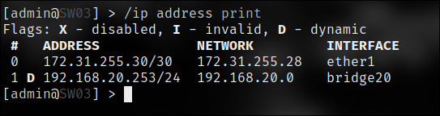

University: [ITMO University](https://itmo.ru/ru/)

Faculty: [FICT](https://fict.itmo.ru)

Course: [Introduction in routing](https://github.com/itmo-ict-faculty/introduction-in-routing)

Year: 2023/2024

Group: K66666
Author: Filianin Ivan Victorovich

Lab: Lab1

Date of create: 20.09.2024

Date of finished:

## Лабораторная 1

### Топология сети:

### Результаты настройки

- Router

- Switch 1

- Switch 2

- Switch 3

- PC 1

- PC 2

