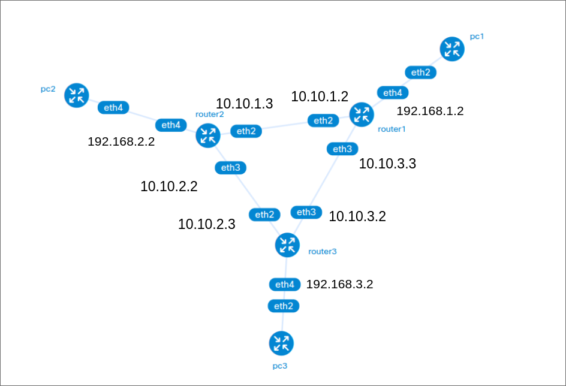
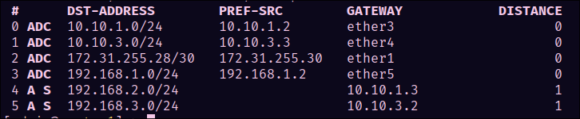
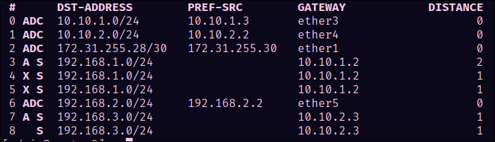
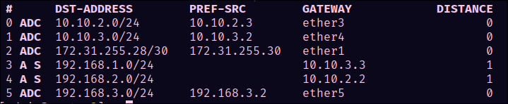
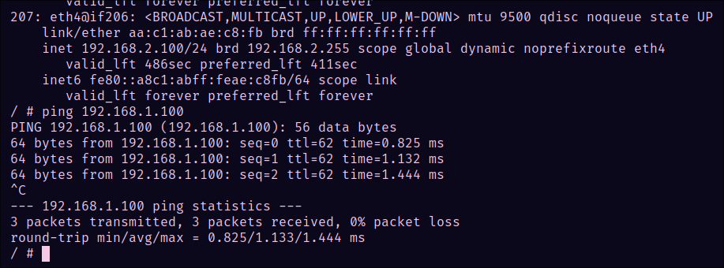

University: [ITMO University](https://itmo.ru/ru/)

Faculty: [FICT](https://fict.itmo.ru)

Course: [Introduction in routing](https://github.com/itmo-ict-faculty/introduction-in-routing)

Year: 2024/2025

Group: K3323

Author: Vlasov Aleksandr Alekseevich

Lab: Lab2

Date of create: 10.10.2024

Date of finished: 16.10.2024


## Лабораторная 2

### Топология сети:



### Конфги:

- Router 1

```
/interface wireless security-profiles
set [ find default=yes ] supplicant-identity=MikroTik
/ip pool
add name=msk ranges=192.168.1.3-192.168.1.100
/ip dhcp-server
add address-pool=msk disabled=no interface=ether5 name=msk
/ip address
add address=10.10.1.2/30 interface=ether3 network=10.10.1.0
add address=10.10.3.3/30 interface=ether4 network=10.10.3.0
add address=192.168.1.2/24 interface=ether5 network=192.168.1.0
/ip dhcp-client
add disabled=no interface=ether1
/ip dhcp-server network
add address=192.168.1.0/24 dns-server=8.8.8.8,8.8.4.4 gateway=192.168.1.2
/ip route
add distance=1 dst-address=192.168.2.0/24 gateway=10.10.1.3
add distance=1 dst-address=192.168.3.0/24 gateway=10.10.3.2
```

- Router 2

```
/interface wireless security-profiles
set [ find default=yes ] supplicant-identity=MikroTik
/ip pool
add name=brl ranges=192.168.2.3-192.168.2.100
/ip dhcp-server
add address-pool=brl disabled=no interface=ether5 name=brl
/ip address
add address=10.10.1.3/30 interface=ether3 network=10.10.1.0
add address=10.10.2.2/30 interface=ether4 network=10.10.2.0
add address=192.168.2.2/24 interface=ether5 network=192.168.2.0
/ip dhcp-client
add disabled=no interface=ether1
/ip dhcp-server network
add address=192.168.2.0/24 dns-server=8.8.8.8,8.8.4.4 gateway=192.168.2.2
/ip route
add distance=1 dst-address=192.168.1.0/24 gateway=10.10.1.2
add distance=1 dst-address=192.168.3.0/24 gateway=10.10.2.3
```

- Router 3

```
/interface wireless security-profiles
set [ find default=yes ] supplicant-identity=MikroTik
/ip pool
add name=frt ranges=192.168.3.3-192.168.3.100
/ip dhcp-server
add address-pool=frt disabled=no interface=ether5 name=frt
/ip address
add address=10.10.2.3/30 interface=ether3 network=10.10.2.0
add address=10.10.3.2/30 interface=ether4 network=10.10.3.0
add address=192.168.3.2/24 interface=ether5 network=192.168.3.0
/ip dhcp-client
add disabled=no interface=ether1
/ip dhcp-server network
add address=192.168.3.0/24 dns-server=8.8.8.8,8.8.4.4 gateway=192.168.3.2
/ip route
add distance=1 dst-address=192.168.1.0/24 gateway=10.10.3.3
add distance=1 dst-address=192.168.2.0/24 gateway=10.10.2.2
```

- PC

```
apk add dhcpcd
dhcpcd
ip route del default
```

### Результаты настройки

- Router 1



- Router 2



- Router 3



## Пример пинга


