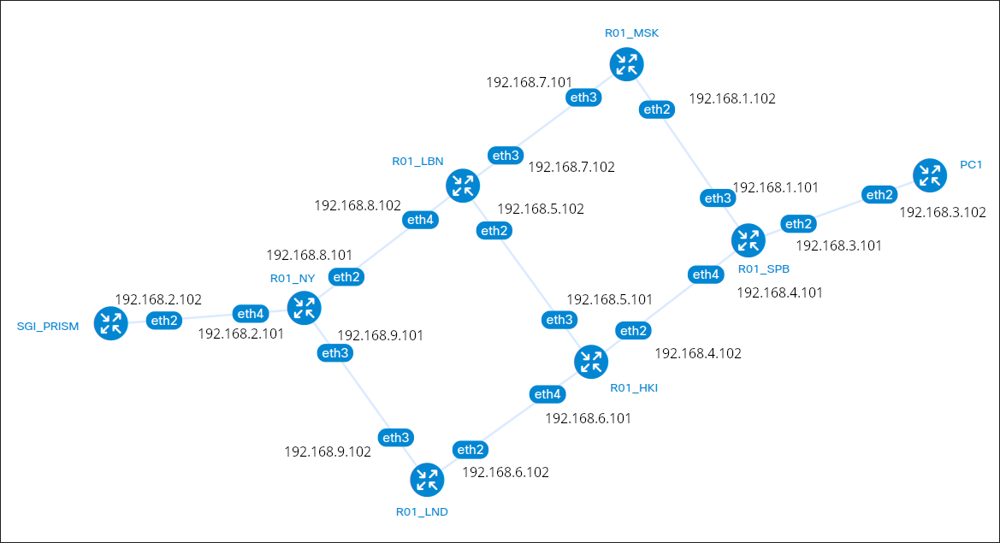
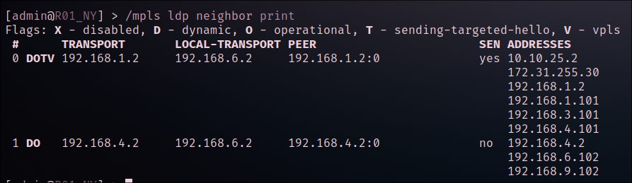
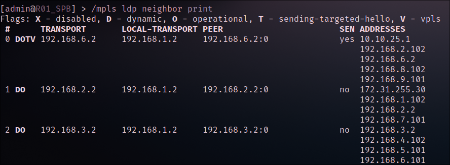
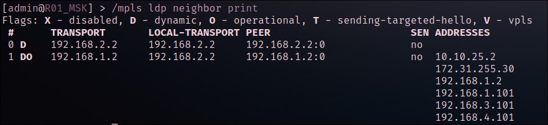
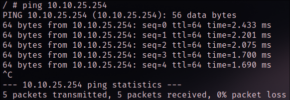
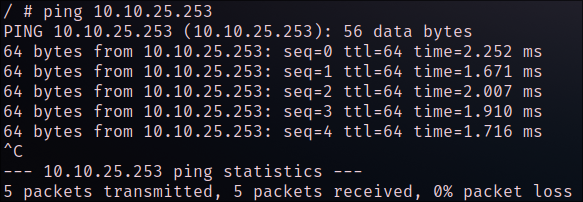

University: [ITMO University](https://itmo.ru/ru/)

Faculty: [FICT](https://fict.itmo.ru)

Course: [Introduction in routing](https://github.com/itmo-ict-faculty/introduction-in-routing)

Year: 2024/2025

Group: K3323

Author: Vlasov Aleksandr Alekseevich

Lab: Lab2

Date of create: 01.11.2024

Date of finished: 06.11.2024


## Лабораторная 2

### Топология сети:



### Конфги:

- Router SPB

```
/interface bridge
add name=loopback0
add name=vpls1
/interface ethernet
set [ find default-name=ether1 ] disable-running-check=no
set [ find default-name=ether2 ] disable-running-check=no
set [ find default-name=ether3 ] disable-running-check=no
set [ find default-name=ether4 ] disable-running-check=no
set [ find default-name=ether5 ] disable-running-check=no
/interface vpls
add disabled=no l2mtu=1500 mac-address=02:D5:99:AF:81:85 name=eovpls remote-peer=192.168.6.2 vpls-id=65500:666
/interface wireless security-profiles
set [ find default=yes ] supplicant-identity=MikroTik
/ip pool
add name=dhcp_pool_vpls1 ranges=10.10.25.3-10.10.25.254
/ip dhcp-server
add address-pool=dhcp_pool_vpls1 disabled=no interface=vpls1 name=dhcp_vpls1
/routing ospf instance
set [ find default=yes ] router-id=192.168.1.2
/interface bridge port
add bridge=vpls1 interface=ether3
add bridge=vpls1 interface=eovpls
/ip address
add address=172.31.255.30/30 interface=ether1 network=172.31.255.28
add address=192.168.1.2 interface=loopback0 network=192.168.1.2
add address=192.168.1.101/30 interface=ether4 network=192.168.1.100
add address=192.168.3.101/30 interface=ether3 network=192.168.3.100
add address=192.168.4.101/30 interface=ether5 network=192.168.4.100
add address=10.10.25.2/24 interface=vpls1 network=10.10.25.0
/ip dhcp-client
add disabled=no interface=ether1
/ip dhcp-server network
add address=10.10.25.0/29 dns-server=8.8.8.8,8.8.4.4 gateway=10.10.25.1
/mpls ldp
set enabled=yes lsr-id=192.168.1.2 transport-address=192.168.1.2
/mpls ldp interface
add interface=ether3
add interface=ether4
add interface=ether5
/routing ospf network
add area=backbone network=192.168.1.100/30
add area=backbone network=192.168.3.100/30
add area=backbone network=192.168.4.100/30
add area=backbone network=192.168.1.2/32
/system identity
set name=R01_SPB
```

- Router NY

```
/interface bridge
add name=loopback0
add name=vpls1
/interface ethernet
set [ find default-name=ether1 ] disable-running-check=no
set [ find default-name=ether2 ] disable-running-check=no
set [ find default-name=ether3 ] disable-running-check=no
set [ find default-name=ether4 ] disable-running-check=no
set [ find default-name=ether5 ] disable-running-check=no
/interface vpls
add disabled=no l2mtu=1500 mac-address=02:5C:67:11:1C:D6 name=eovpls \
    remote-peer=192.168.1.2 vpls-id=65500:666
/interface wireless security-profiles
set [ find default=yes ] supplicant-identity=MikroTik
/routing ospf instance
set [ find default=yes ] router-id=192.168.6.2
/interface bridge port
add bridge=vpls1 interface=ether5
add bridge=vpls1 interface=eovpls
/ip address
add address=172.31.255.30/30 interface=ether1 network=172.31.255.28
add address=192.168.6.2 interface=loopback0 network=192.168.6.2
add address=192.168.8.102/30 interface=ether3 network=192.168.8.100
add address=192.168.9.101/30 interface=ether4 network=192.168.9.100
add address=192.168.2.102/30 interface=ether5 network=192.168.2.100
add address=10.10.25.1/29 interface=vpls1 network=10.10.25.0
/ip dhcp-client
add disabled=no interface=ether1
/mpls ldp
set enabled=yes lsr-id=192.168.6.2 transport-address=192.168.6.2
/mpls ldp interface
add interface=ether3
add interface=ether4
add interface=ether5
/routing ospf network
add area=backbone network=192.168.8.100/30
add area=backbone network=192.168.9.100/30
add area=backbone network=192.168.6.2/32
/system identity
set name=R01_NY
```

- Пример для остальных роутеров

```
/interface wireless security-profiles
set [ find default=yes ] supplicant-identity=MikroTik
/ip pool
add name=frt ranges=192.168.3.3-192.168.3.100
/ip dhcp-server
add address-pool=frt disabled=no interface=ether5 name=frt
/ip address
add address=10.10.2.3/30 interface=ether3 network=10.10.2.0
add address=10.10.3.2/30 interface=ether4 network=10.10.3.0
add address=192.168.3.2/24 interface=ether5 network=192.168.3.0
/ip dhcp-client
add disabled=no interface=ether1
/ip dhcp-server network
add address=192.168.3.0/24 dns-server=8.8.8.8,8.8.4.4 gateway=192.168.3.2
/ip route
add distance=1 dst-address=192.168.1.0/24 gateway=10.10.3.3
add distance=1 dst-address=192.168.2.0/24 gateway=10.10.2.2
```

- PC

```
apk add dhcpcd
dhcpcd
```

### Результаты настройки

- Router NY



- Router SPB



- Router MSK



## Результаты пинга




