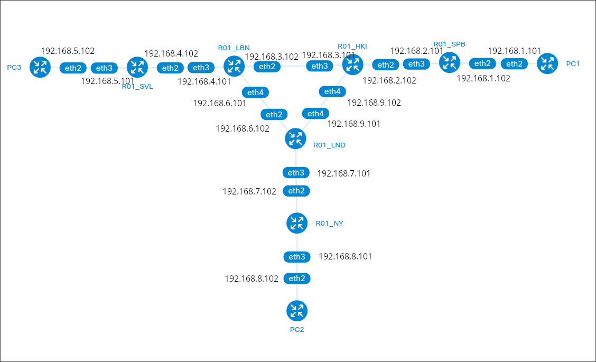
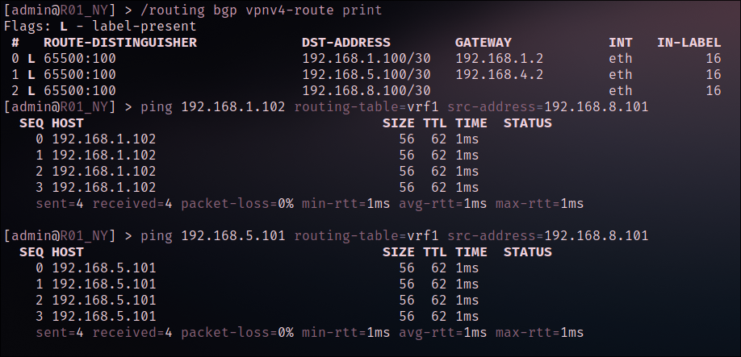
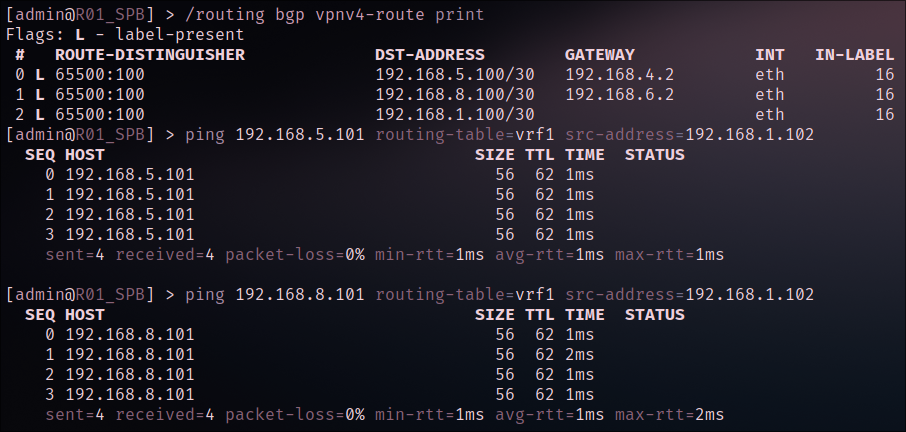
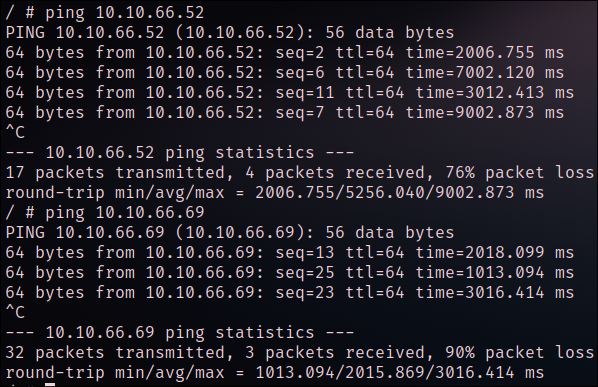
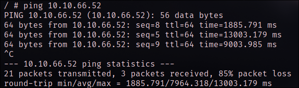
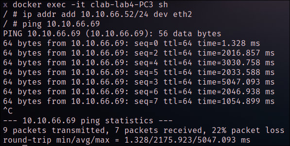

University: [ITMO University](https://itmo.ru/ru/)

Faculty: [FICT](https://fict.itmo.ru)

Course: [Introduction in routing](https://github.com/itmo-ict-faculty/introduction-in-routing)

Year: 2024/2025

Group: K3323

Author: Vlasov Aleksandr Alekseevich

Lab: Lab2

Date of create: 01.11.2024

Date of finished: 06.11.2024


## Лабораторная 4

## Топология сети:



### Часть 1

### Конфиги:

- Router SPB

```
/interface bridge
add name=loopback0
/interface ethernet
set [ find default-name=ether1 ] disable-running-check=no
set [ find default-name=ether2 ] disable-running-check=no
set [ find default-name=ether3 ] disable-running-check=no
set [ find default-name=ether4 ] disable-running-check=no
/interface wireless security-profiles
set [ find default=yes ] supplicant-identity=MikroTik
/routing bgp instance
set default as=65500 router-id=192.168.1.2
/routing ospf instance
set [ find default=yes ] router-id=192.168.1.2
/ip address
add address=172.31.255.30/30 interface=ether1 network=172.31.255.28
add address=192.168.1.2 interface=loopback0 network=192.168.1.2
add address=192.168.2.101/30 interface=ether4 network=192.168.2.100
add address=192.168.1.102/30 interface=ether3 network=192.168.1.100
/ip dhcp-client
add disabled=no interface=ether1
/ip route vrf
add export-route-targets=65500:100 import-route-targets=65500:100 \
    interfaces=ether3 route-distinguisher=65500:100 routing-mark=vrf1
/mpls ldp
set enabled=yes lsr-id=192.168.1.2 transport-address=192.168.1.2
/mpls ldp interface
add interface=ether3
add interface=ether4
/routing bgp instance vrf
add redistribute-connected=yes redistribute-ospf=yes routing-mark=vrf1
/routing bgp peer
add address-families=vpnv4 name=peer1 remote-address=192.168.2.2 remote-as=\
    65500 update-source=loopback0
/routing ospf network
add area=backbone network=192.168.1.100/30
add area=backbone network=192.168.2.100/30
add area=backbone network=192.168.1.2/32
```

- Router HKI

```
/interface bridge
add name=loopback0
/interface ethernet
set [ find default-name=ether1 ] disable-running-check=no
set [ find default-name=ether2 ] disable-running-check=no
set [ find default-name=ether3 ] disable-running-check=no
set [ find default-name=ether4 ] disable-running-check=no
set [ find default-name=ether5 ] disable-running-check=no
/interface wireless security-profiles
set [ find default=yes ] supplicant-identity=MikroTik
/routing bgp instance
set default as=65500 router-id=192.168.2.2
/routing ospf instance
set [ find default=yes ] router-id=192.168.2.2
/ip address
add address=172.31.255.30/30 interface=ether1 network=\
    172.31.255.28
add address=192.168.2.2 interface=loopback0 network=192.168.2.2
add address=192.168.2.102/30 interface=ether3 network=\
    192.168.2.100
add address=192.168.3.101/30 interface=ether4 network=\
    192.168.3.100
add address=192.168.9.102/30 interface=ether5 network=\
    192.168.9.100
/ip dhcp-client
add disabled=no interface=ether1
/mpls ldp
set enabled=yes lsr-id=192.168.2.2 transport-address=192.168.2.2
/mpls ldp interface
add interface=ether3
add interface=ether4
add interface=ether5
/routing bgp peer
add address-families=vpnv4 name=peer1 remote-address=192.168.1.2 \
    remote-as=65500 update-source=loopback0
add address-families=vpnv4 name=peer2 remote-address=192.168.3.2 \
    remote-as=65500 route-reflect=yes update-source=loopback0
add address-families=vpnv4 name=peer3 remote-address=192.168.5.2 \
    remote-as=65500 route-reflect=yes update-source=loopback0
/routing ospf network
add area=backbone network=192.168.2.100/30
add area=backbone network=192.168.3.100/30
add area=backbone network=192.168.9.100/30
add area=backbone network=192.168.2.2/32
```

### Пинги и настройки

- Router SVL


- Router NY


- Router SPB



## Часть 2

### Конфиги

- Router SPB

```
/interface bridge
add name=loopback0
add name=vpls protocol-mode=none
/interface ethernet
set [ find default-name=ether1 ] disable-running-check=no
set [ find default-name=ether2 ] disable-running-check=no
set [ find default-name=ether3 ] disable-running-check=no
set [ find default-name=ether4 ] disable-running-check=no
/interface wireless security-profiles
set [ find default=yes ] supplicant-identity=MikroTik
/routing bgp instance
set default as=65500 router-id=192.168.1.2
/routing ospf instance
set [ find default=yes ] router-id=192.168.1.2
/interface bridge port
add bridge=vpls interface=ether3
/interface vpls bgp-vpls
add bridge=vpls export-route-targets=1:2 import-route-targets=1:2 name=vpls \
    route-distinguisher=1:2
/ip address
add address=172.31.255.30/30 interface=ether1 network=172.31.255.28
add address=192.168.1.2 interface=loopback0 network=192.168.1.2
add address=192.168.2.101/30 interface=ether4 network=192.168.2.100
add address=192.168.1.102/30 interface=ether3 network=192.168.1.100
add address=10.10.66.10/24 interface=vpls network=10.10.66.0
/ip dhcp-client
add disabled=no interface=ether1
/mpls ldp
set enabled=yes lsr-id=192.168.1.2 transport-address=192.168.1.2
/mpls ldp interface
add interface=ether3
add interface=ether4
/routing bgp instance vrf
add redistribute-connected=yes redistribute-ospf=yes routing-mark=vrf1
/routing bgp peer
add address-families=l2vpn name=peer1 remote-address=192.168.2.2 remote-as=\
    65500 update-source=loopback0
/routing ospf network
add area=backbone network=192.168.1.100/30
add area=backbone network=192.168.2.100/30
add area=backbone network=192.168.1.2/32
/system identity
set name=R01_SPB
```

- Router NY

```
/interface bridge
add name=loopback0
add name=vpls protocol-mode=none
/interface ethernet
set [ find default-name=ether1 ] disable-running-check=no
set [ find default-name=ether2 ] disable-running-check=no
set [ find default-name=ether3 ] disable-running-check=no
set [ find default-name=ether4 ] disable-running-check=no
/interface wireless security-profiles
set [ find default=yes ] supplicant-identity=MikroTik
/routing bgp instance
set default as=65500 router-id=192.168.6.2
/routing ospf instance
set [ find default=yes ] router-id=192.168.6.2
/interface bridge port
add bridge=vpls interface=ether4
/interface vpls bgp-vpls
add bridge=vpls export-route-targets=1:2 import-route-targets=1:2 name=vpls \
    route-distinguisher=1:2 site-id=6
/ip address
add address=172.31.255.30/30 interface=ether1 network=172.31.255.28
add address=192.168.6.2 interface=loopback0 network=192.168.6.2
add address=192.168.7.102/30 interface=ether3 network=192.168.7.100
add address=192.168.8.101/30 interface=ether4 network=192.168.8.100
add address=10.10.66.60/24 interface=vpls network=10.10.66.0
/ip dhcp-client
add disabled=no interface=ether1
/mpls ldp
set enabled=yes lsr-id=192.168.6.2 transport-address=192.168.6.2
/mpls ldp interface
add interface=ether3
add interface=ether4
/routing bgp instance vrf
add redistribute-connected=yes redistribute-ospf=yes routing-mark=vrf1
/routing bgp peer
add address-families=l2vpn name=peer1 remote-address=192.168.5.2 remote-as=\
    65500 update-source=loopback0
/routing ospf network
add area=backbone network=192.168.7.100/30
add area=backbone network=192.168.8.100/30
add area=backbone network=192.168.6.2/32
/system identity
set name=R01_NY
```

- PC1

```
ip addr add 10.10.66.42/24 dev eth2
```

- PC2

```
ip addr add 10.10.66.69/24 dev eth2
```

- PC3

```
ip addr add 10.10.66.52/24 dev eth2
```

### Результаты пингов

- PC1



- PC2



- PC3


